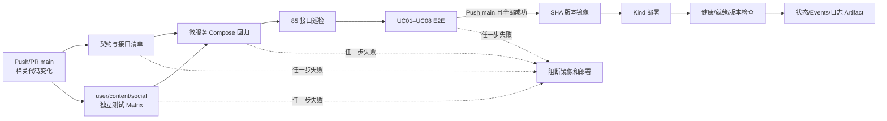

# StreamHub 微服务自动构建、部署与运维验收报告

验证日期：2026-08-30 至 2026-08-31。范围：课程“后 5 天”第 2 项。工作目录仅为 `C:\Users\lausu\Desktop\SE2026-microservices`；没有提交、推送或触发远端 GitHub Actions。

## 0. 2026-09-01 队友 CI/CD 整合说明

- 上游来源：`https://github.com/Cespale/SE2026` 的 CI 专用提交 `76b18e947342fcb459e3ef7c008e4c0f53aa108b`。
- 上游新增的关键行为是三个 Job 全部使用 `runs-on: self-hosted`；但其测试、镜像和 K8s 清单只面向单体后端与前端。
- 原样覆盖会让三业务微服务不再独立测试、构建和部署，因此没有机械复制。当前工作流保留既有四门禁、三个服务 Matrix、85 项 API、UC01–UC08 E2E、5 个镜像、GHCR、Kind 和诊断证据，只整合上游 self-hosted 运行模型。
- 可信的 `push main` 使用 `self-hosted`；公共仓库 `pull_request` 使用隔离的 `ubuntu-latest`。这是安全边界，不是功能删减。
- 改造前完整副本：`C:\Users\lausu\Desktop\SE2026-microservices-backup-before-teammate-cicd-20260901-091249`。备份与源均为 31,295 个文件、1,338,318,503 字节；Robocopy 差异检查为 0，原工作流 SHA-256 为 `E37279A6D77C21D7FC48EE3DC2DF1C9D3AA2772E4B5657300016623170B6A2B6`。
- 本次仍没有 commit/push。self-hosted 远程运行必须由 Linux x64 Runner 实际上线后另行验证，不能用本地契约测试冒充。
- 2026-09-01 最终本地整合版本为 `teammate-cicd-integrated-final2-20260901`：合同 82 项、user 12 项、content 14 项、social 13 项、公开 API 85/85、E2E 3/3 全部通过；同版本部署到 `streamhub-cicd` 后，12/12 健康/就绪/版本检查及 Kind 网关 85/85 API 再次通过。
- 第一次整套验证失败证据被保留：Docker 只有 7.46 GiB 且多个 Kind 控制面并行，E2E 在不同步骤随机超时。暂停额外 Kind 后通过，说明根因是自托管宿主机资源争用。生产 Runner 至少提供 8 GiB、推荐 12 GiB，并避免流水线期间并行运行无关 Kind 集群。

## 1. 结论

| 要求 | 本地结果 | 证据/实现 |
|---|---|---|
| 提交后自动执行 | 已配置；Push/PR `main` 且微服务相关路径变化时触发 | `.github/workflows/ci.yml` |
| 三服务独立测试 | user 12、content 14、social 13，共 39 项通过；另有微服务/共享合同 82 项 | `service-tests` Matrix；各服务独立 JUnit |
| 自动制作版本镜像 | 本地已实跑；最终不可变版本 `teammate-cicd-integrated-final2-20260901` | 5 个本地镜像；远端正式标签使用 Git SHA 前 8 位 |
| 测试失败阻断部署 | 契约通过；`build-deploy` 必须等待三个测试门禁成功，且不使用 `always()` | `needs: [contract-tests, service-tests, microservices-regression]` |
| 自动部署 | Compose 与 Kind 一键链路均在 Windows PowerShell 5.1 本地实跑通过 | `run-kind-cicd-gate.ps1`；`kind-result.txt` |
| 全公开接口 API 测试 | 85/85：83 个 HTTP 网关运行时巡检；2 个 WebSocket 由真实服务行为测试覆盖 | `public_api_smoke.py`、`public-api.xml/json` |
| UC01–UC08 E2E | 最终整合版本本地门禁 3/3；组合覆盖 UC01–UC08 | `.ci-results/microservices-local/teammate-cicd-integrated-final2-20260901/e2e.xml` |
| 日志/健康/就绪/版本 | Gateway 与三业务服务共 12 个检查全部通过，精确版本为 `teammate-cicd-integrated-final2-20260901` | `.ci-results/kind-cicd/teammate-cicd-integrated-final2-20260901/` |
| 部署失败排查 | 已执行安全的“缺失镜像标签”受控失败；退出码 125，服务和数据未受影响 | `deployment-failure-drill/*` |

## 2. 流水线设计



流水线只对 `services/**`、`shared/**`、`gateway/**`、数据库/Kubernetes/测试/前端等相关代码路径触发，纯 `docs/**` 修改不浪费构建资源。因为三个服务共享契约且 UC01–UC08 是跨服务流程，当前采用保守策略：一次相关后端变化会回归三个服务；代价是耗时更长，但避免漏测跨服务兼容性。

四个门禁：

1. `contract-tests`：工作区、Schema、网关、Kubernetes、接口清单和 CI/CD 契约。
2. `service-tests`：三个业务服务以 Matrix 在独立 Runner 中安装依赖并测试。
3. `microservices-regression`：构建并部署 Compose 测试栈，执行全部公开接口巡检和 UC01–UC08。
4. `build-deploy`：仅 Push `main` 且前三项成功后，制作/发布 SHA 镜像，部署 Kind，检查并保存日志。

所有 Job 都用 `if: always()` 上传本阶段 Artifact；但部署 Job 本身不使用 `always()`，所以测试失败不会绕过门禁。

## 3. API 与端到端测试口径

公开接口清单共有 85 项：user 30、content 23、social 32。

- 83 个 HTTP 接口全部从 `8100` 网关发送真实请求。公开接口验证实际路由；受保护接口验证 401/403；参数/请求体错误验证 422；不存在资源允许业务 404。任何 5xx、405 或网关“接口不存在”404 都判失败。
- 这类巡检证明“接口存在、网关归属正确、鉴权/校验/失败返回可用”，不能代替全部业务成功路径。业务成功路径和跨服务失败路径继续由三个服务的 pytest 覆盖。
- 2 个 WebSocket 接口分别由 `test_chat_notification_api.py` 和 `test_live_api.py` 建立真实 TestClient WebSocket；不能把普通 HTTP 404 当成 WebSocket 测试。
- 三条 Playwright 场景覆盖正式范围：UC01–02、UC03–05、UC06–08。

本地成功证据目录：

`C:\Users\lausu\Desktop\SE2026-microservices\.ci-results\microservices-local\local-ci-20260830-fix1`

教师终验新一轮：

`C:\Users\lausu\Desktop\SE2026-microservices\.ci-results\microservices-local\teacher-audit-20260831`

历史成功证据中已有多轮 3/3；本次教师门禁独立运行 3/3（57.1 秒），随后用独立 JUnit/附件目录复跑 3/3（56.3 秒）。两轮不是并发重复读取同一报告，入口分别是 `.ci-results/microservices-local/teacher-audit-20260831/e2e.xml` 和 `work/teacher-final-audit/e2e-run-2.xml`。

最终 Docker→Compose→Kind 一键流水线证据：

`C:\Users\lausu\Desktop\SE2026-microservices\.ci-results\kind-cicd\teacher-kind-cicd-final2-20260831`

该轮当前代码合同/共享 79 项、三服务 39 项、API 85/85、E2E 3/3；`result.txt` 与 `kind-result.txt` 均为 PASS。Kind 中 3 个业务服务、Gateway、PostgreSQL、MinIO 均 Ready，迁移 Job Completed，Metrics API 可返回 Pod CPU/内存。

## 4. 日志、健康、就绪与版本

现场查看：

```powershell
docker compose -f docker-compose.microservices.yml --env-file .env.microservices ps
docker compose -f docker-compose.microservices.yml --env-file .env.microservices logs --tail 100 user-service content-service social-service
Invoke-RestMethod http://127.0.0.1:8100/_services/user/health
Invoke-RestMethod http://127.0.0.1:8100/_services/user/ready
Invoke-RestMethod http://127.0.0.1:8100/_services/user/version
```

content/social 把最后一段 `user` 换成对应名称。Gateway 自身提供 `/health`、`/ready`、`/version`。版本由 `APP_VERSION` 注入，不再写死。

Kubernetes 现场使用：

```powershell
$kubeconfig = (Resolve-Path '.ci-results\cloud-native\kind-lab-kubeconfig').Path
kubectl --kubeconfig $kubeconfig get deployment,pods,services,hpa -n streamhub-ms -o wide
kubectl --kubeconfig $kubeconfig get events -n streamhub-ms --sort-by=.metadata.creationTimestamp
kubectl --kubeconfig $kubeconfig logs deployment/user-service -n streamhub-ms --tail=200
```

## 5. 一次部署失败怎么查

受控故障：请求运行不存在的不可变镜像 `streamhub-user-service:missing-*`，同时指定 `--pull=never`。这不会拉取镜像、重建现有服务、停止容器或修改数据卷。

排查链：

1. 部署命令退出 125，第一条错误是 `No such image`。
2. `docker image inspect` 对失败标签退出 1，确认不是应用启动后崩溃。
3. 对照检查 `streamhub-user-service:local-ci-20260830-fix1` 存在。
4. 查询当前 `/_services/user/version`，确认运行服务仍是正确版本且未受影响。
5. 修复方式是改回已构建的不可变标签，再检查 `/ready` 和 `/version`。

若 Kubernetes 出现同类问题，按 `rollout status → get pods → events → describe → logs` 排查；`ImagePullBackOff` 应先核对镜像仓库、标签和拉取权限，而不是先改数据库。

受控失败证据位于：

`C:\Users\lausu\Desktop\SE2026-microservices\.ci-results\deployment-failure-drill\20260830221958592`

### 实际发现并修复的失败

一次最终回归中，API 巡检仍为 85/85，但 TC01 首次导航耗时 34.96 秒并触发 Playwright 30 秒超时。Trace 同时证明登录、评论和弹幕请求均为 HTTP 200，因此不是业务接口故障。根因是 frontend 没有 Compose 健康检查：容器已启动不等于 Webpack 已可服务，`compose up --wait` 因而过早放行。修复是在 frontend 上增加 `3266` 端口 HTTP 健康检查；没有通过放宽 E2E 超时掩盖问题。原失败截图、视频、Trace 和错误上下文继续保留在 `local-ci-20260830` 证据目录中。

最终 Kind CI/CD 实跑还发现并修复了四类干净机器问题：Windows PowerShell 5.1 会把预期的原生命令非零退出提升为终止错误；MinIO 的本地多平台 manifest 只有 amd64 内容，不能用 Kind 的 all-platform 直接导入；`BACKEND_ONLY=true` 时前端/SRS Deployment 不存在，不能无条件缩容；内联 JSON Patch 在 PowerShell 5.1 中丢失引号。修复分别是受控探针函数、amd64 单平台归档、存在性检查和 `--patch-file`。每项均先由失败测试或最小复现确认，再修复复跑。

另一次完整 E2E 在投稿上传后的资源回落窗口使直播详情两次超过 2 秒网关预算，Trace 显示房间已创建且 WebSocket 已连接，HTTP 才返回设计的 503。直播场景改为先条件轮询公开详情到 200，再导航观众页面；持续 503 仍会失败。失败运行现在也总会保存 Compose 状态、服务日志、Playwright 附件和明确的 FAIL 原因。

## 6. 本地复跑

```powershell
& .\scripts\run-local-microservices-gate.ps1 -Version 'teacher-audit-20260831'
& .\scripts\run-kind-cicd-gate.ps1 -Version 'teacher-kind-cicd-final2-20260831' -ClusterName 'streamhub-cicd'
& .\scripts\run-deployment-failure-drill.ps1 -GoodVersion 'teacher-audit-20260831'
```

脚本不执行 `compose down -v`，不会删除 PostgreSQL、MinIO 或媒体数据。

## 7. 事实边界与成本

1. **远端未实跑。**GitHub Actions、GHCR 和 Kind Job 已配置并通过本地契约检查，但因为没有 commit/push，没有远端 Run、Artifact 或 GHCR 发布记录，不能写成远端 CI/CD 已通过。
2. **Kubernetes 范围。**本地 Kind 已真实完成一键 CI/CD、HPA 和故障实验；远程 GitHub Runner 内的 Kind 仍未运行。两者不能混为一谈。
3. **接口测试层次不同。**85/85 是“全接口清单覆盖”；其中受保护接口的巡检通常验证未授权/校验失败，完整成功路径由服务 pytest 和 E2E 补足。
4. **构建成本仍需关注。**最终镜像约为 frontend 635 MiB、content 138 MiB、user 70 MiB、social 64 MiB、gateway 20 MiB；`.dockerignore` 已排除依赖、虚拟环境和测试证据，但 `public/demo-videos` 仍包含约 464.36 MiB 的课程演示视频，因此前端构建上下文实测约 532 MiB。直接排除视频会破坏本地演示；若要优化，应迁移到对象存储或独立数据包。
5. **性能结论已单独验证。**第 4 项已完成同机、同数据、同脚本各 3 次；结果不支持“微服务性能提升”，详见性能报告。

参考依据：GitHub Actions 官方 `needs`/工作流语法、Artifact 与容器发布说明；Kubernetes 官方 Deployment、Probe 和 Debug Running Pods 文档。

零基础本地运行入口：`docs/getting-started/README.md`；其中分别提供 Compose、Kind CI/CD、测试排障三份操作 README。
