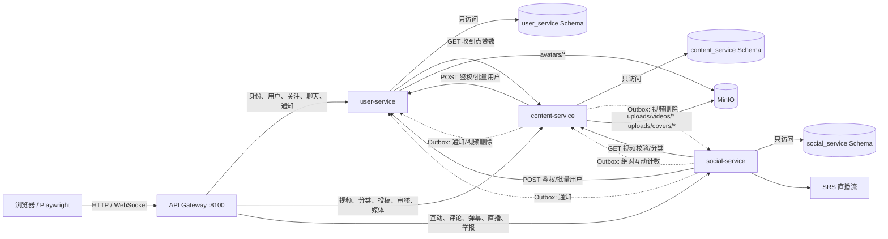

# StreamHub 三业务微服务划分

## 结论

后端划分为 user、content、social 三个业务服务。划分依据是业务能力、数据一致性边界、故障影响和扩缩容特征，不是按 UC01–UC08 的用例数量机械拆分。Gateway、前端、PostgreSQL、MinIO、SRS 均不计入三项业务服务。

## 服务职责与划分理由

| 业务服务 | 负责业务 | 为什么独立 |
|---|---|---|
| user-service | 注册登录、令牌、资料、头像、关注关系、聊天、通知、用户管理 | 身份和私密通信安全边界一致；用户/关注/消息需要本地事务；故障时不能拖垮公开视频读取。 |
| content-service | 分类、视频元数据、上传、封面、投稿、审核、创作者内容、推荐/搜索/Feed、媒体读取 | 视频生命周期与审核属于同一聚合；媒体 I/O 与内容查询资源特征相近；可以独立部署存储策略。 |
| social-service | 点赞、收藏、评论、弹幕、直播房间、举报、敏感词、互动计数基线 | 互动写入频率和直播连接数波动最大，适合独立扩缩容；故障应隔离，不影响登录和基础视频读取。 |

## 独立构建、测试、部署

| 服务 | Dockerfile | pytest | Compose/K8s 工作负载 | 端口策略 |
|---|---|---|---|---|
| user | `services/user-service/Dockerfile` | `services/user-service/tests` | `user-service` | 8000 仅容器/ClusterIP 内部 |
| content | `services/content-service/Dockerfile` | `services/content-service/tests` | `content-service` | 8000 仅容器/ClusterIP 内部 |
| social | `services/social-service/Dockerfile` | `services/social-service/tests` | `social-service` | 8000 仅容器/ClusterIP 内部 |

三者镜像、依赖文件、测试目录、数据库账号和 Deployment 均独立。公开入口只有 Gateway 8100；Compose 中服务端口未映射到宿主机。

## 数据与一致性规则

- 每张业务表只有一个服务和一个受限数据库账号可读写。
- 三个 Schema 位于同一 PostgreSQL 实例只是节省本地成本，不允许跨 Schema 查询、外键或联表。
- 同步查询走内部 HTTP；读失败可使用标记过的降级值，受保护写入在依赖校验失败时返回 503 且不落本地业务数据。
- 已提交的跨服务写入走本地 Outbox。单次投递失败不会回滚原事务；最多 10 次，指数退避，最终 `dead`，可从内部诊断接口查看。
- 接收端用 `processed_events.event_id` 幂等；互动计数发送绝对值，不用容易重复累加的增量。
- 历史视频聚合计数大于明细行数，因此 social 保存 `video_interaction_baselines` 残差；否则首次互动会错误覆盖历史计数。

## 已验证与边界

当前副本已验证：三个服务独立 pytest 39 项、微服务/共享契约 64 项、CI 契约 12 项、Schema 权限隔离、Compose 整栈、85 个公开接口巡检、UC01–UC08 Playwright 两轮、Outbox 绝对计数回写、头像 MinIO、Kind 集群资源服务端 dry-run 与真实探针。HPA 和故障处理的真实结果见 `cloud-native-experiments.md`；同机性能结果见 `performance-comparison.md`。

边界：远程 GitHub Actions、GHCR 发布没有在本地副本执行，不能写成远程流水线已成功；本地 Kind 是一次性单机实验，不代表生产容量。
