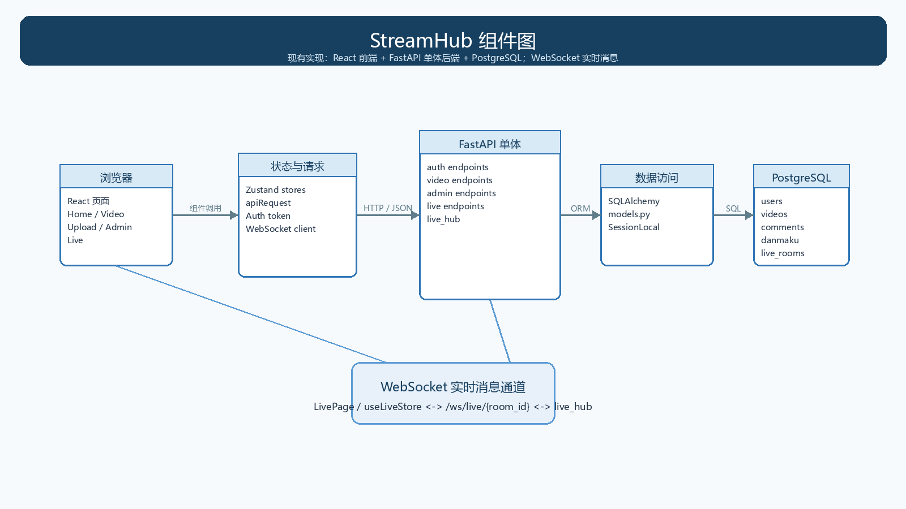
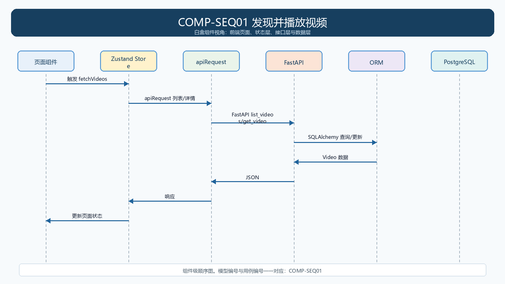
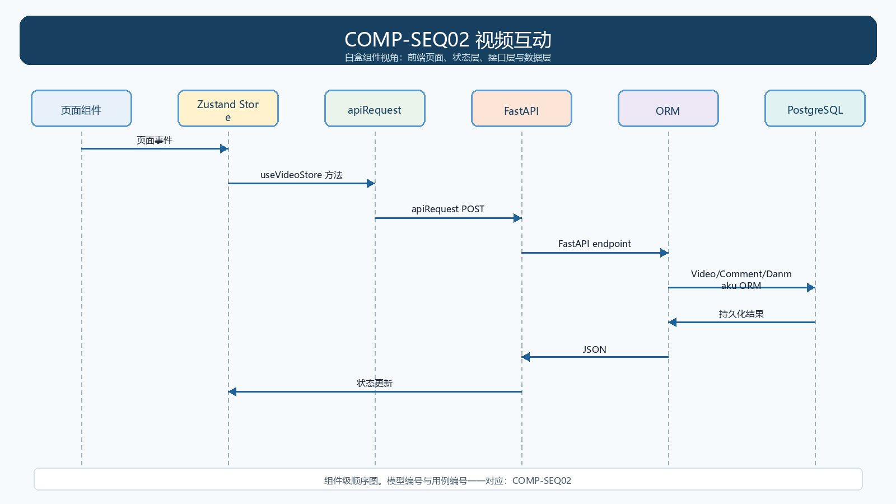
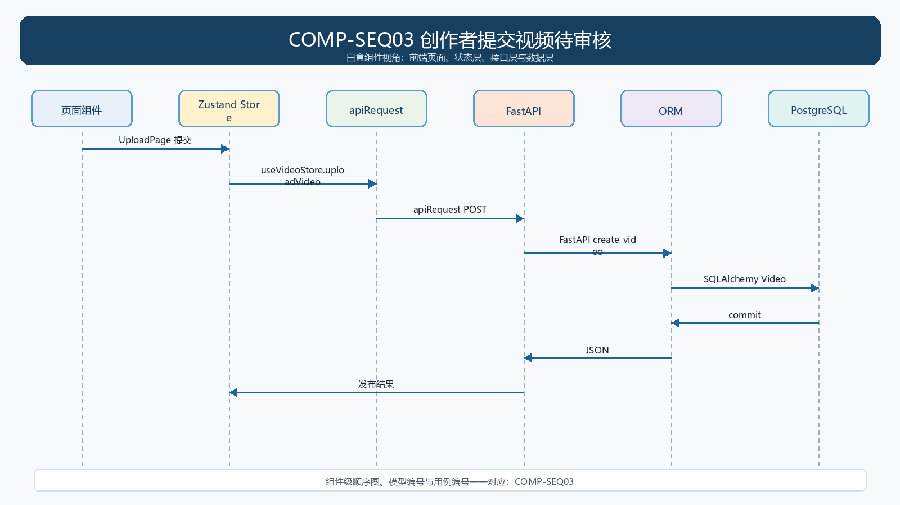
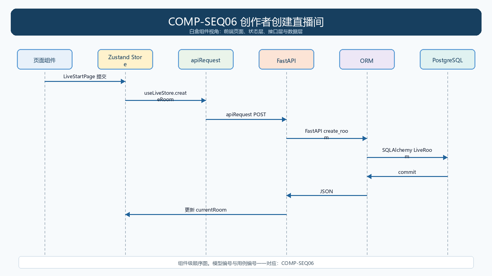
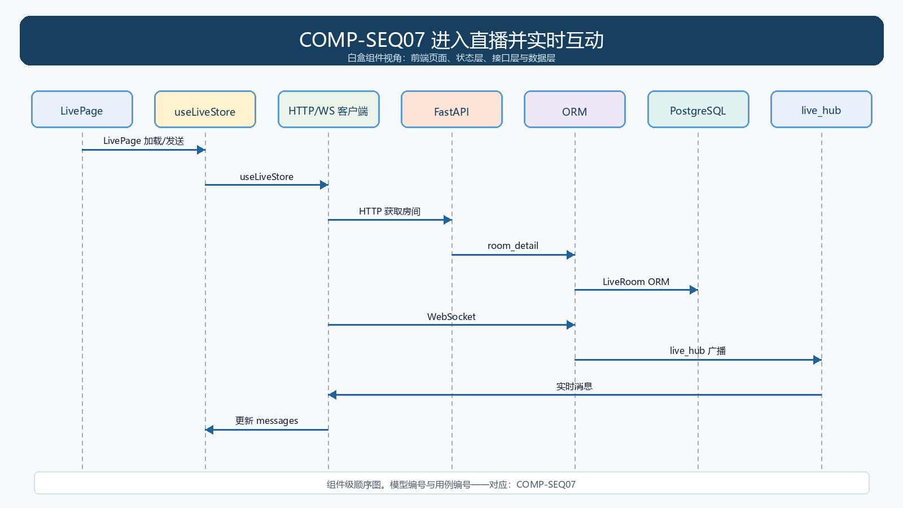
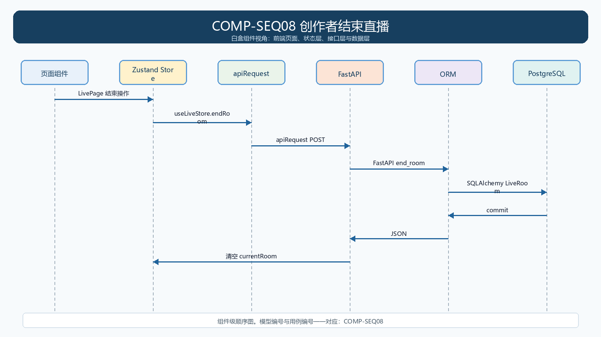

# 第9组 StreamHub 概要设计说明书

> 架构对应当前代码，不把计划中的微服务、Redis、SRS 写成已实现组件。

## 1. 架构风格

前后端分离。浏览器运行 React；Zustand 管理前端状态；`src/api.ts` 发送 REST 请求；FastAPI 在 `backend/app/main.py` 内实现认证、视频、审核、直播端点；SQLAlchemy 访问 PostgreSQL。直播文本互动使用单进程内存 `live_hub` 和 WebSocket。

## 2. 组件图

## 3. 组件职责

| 组件 | 职责 | 主要实现 |
|---|---|---|
| React 页面 | 展示与采集用户操作 | src/pages/*.tsx |
| Zustand Store | 请求、状态归一化、页面状态更新 | src/stores/videoStore.ts、liveStore.ts、authStore.ts |
| API Client | 附加 Token、序列化请求 | src/api.ts |
| FastAPI 单体 | 路由、鉴权、业务写入 | backend/app/main.py、security.py、schemas.py |
| ORM/数据模型 | 持久化 User/Video/Comment/Danmaku/LiveRoom | backend/app/models.py、database.py |
| PostgreSQL | 持久化业务数据 | docker-compose.yml: postgres |

## 4. 每个用例的组件级模型

### COMP-SEQ01 发现并播放视频

- 代码映射：HomePage.tsx、SearchPage.tsx、VideoPage.tsx；videoStore.fetchVideos/fetchVideoDetail；main.py:list_videos/get_video/related
- 接口：见 `main.py:list_videos/get_video/related`。

### COMP-SEQ02 视频互动

- 代码映射：VideoPage.tsx；videoStore.likeVideo/favoriteVideo/addComment/sendDanmaku；main.py:like_video/favorite_video/add_comment/add_danmaku
- 接口：见 `main.py:like_video/favorite_video/add_comment/add_danmaku`。

### COMP-SEQ03 创作者提交视频待审核

- 代码映射：UploadPage.tsx；videoStore.uploadVideo；main.py:create_video；models.py:Video
- 接口：见 `models.py:Video`。

### COMP-SEQ04 管理员审核视频

- 代码映射：AdminPage.tsx；videoStore.fetchPendingVideos/auditVideo；main.py:pending_videos/audit_video
- 接口：见 `main.py:pending_videos/audit_video`。

### COMP-SEQ05 创作者管理本人作品

- 代码映射：CreatorPage.tsx；videoStore.fetchCreatorVideos；main.py:creator_videos
- 接口：见 `main.py:creator_videos`。

### COMP-SEQ06 创作者创建直播间

- 代码映射：LiveStartPage.tsx；liveStore.createRoom；main.py:create_room；models.py:LiveRoom
- 接口：见 `models.py:LiveRoom`。

### COMP-SEQ07 进入直播并实时互动

- 代码映射：LivePage.tsx；liveStore.connectWebSocket/sendDanmaku；main.py:list_rooms/room_detail/live_ws；LiveHub
- 接口：见 `LiveHub`。

### COMP-SEQ08 创作者结束直播

- 代码映射：LivePage.tsx；liveStore.endRoom；main.py:end_room；models.py:LiveRoom
- 接口：见 `models.py:LiveRoom`。

## 5. 接口与数据边界

REST 使用 JSON；受保护 REST 端点依赖 `get_current_user`、`require_creator` 或 `require_admin`。直播消息使用 `/ws/live/{room_id}`。数据库只由 FastAPI 单体通过 SQLAlchemy 访问。

## 6. 当前架构风险

`live_hub` 是进程内内存对象，后续横向扩容前需要共享消息/连接方案。前端有演示回退数据，验收必须同时检查后端响应和刷新后的数据库结果，不能只看页面效果。
