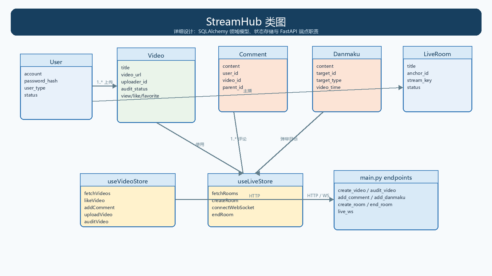
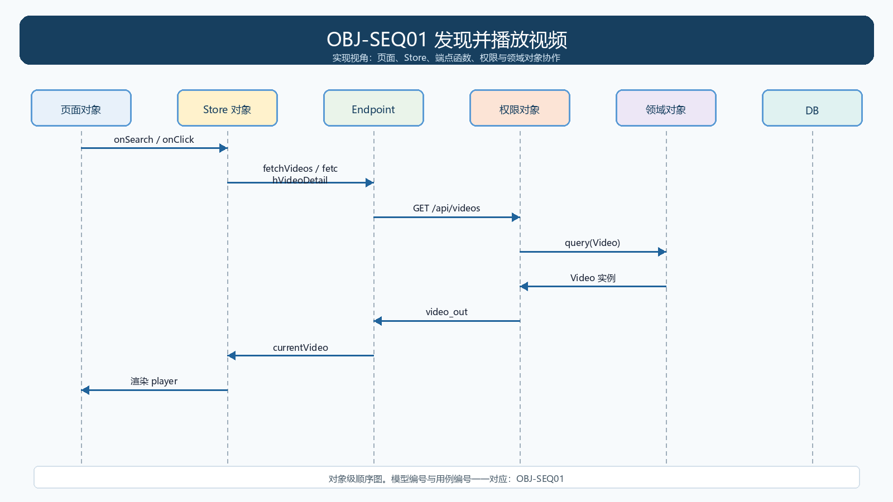
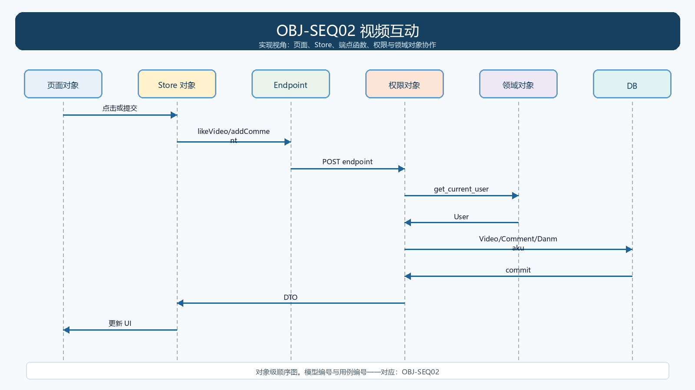
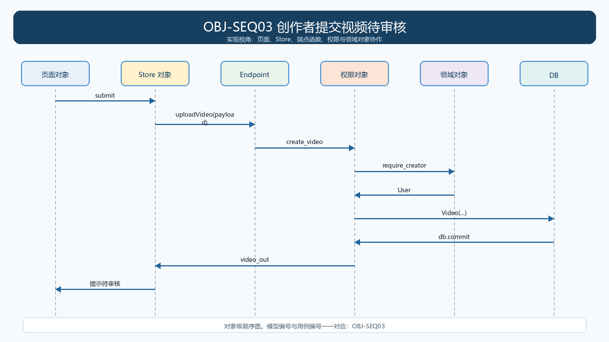
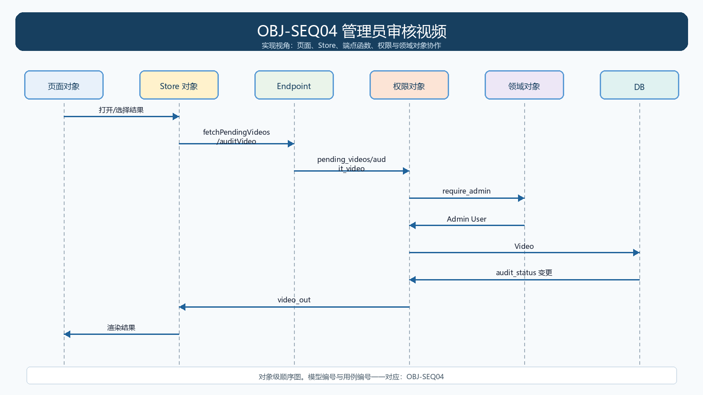
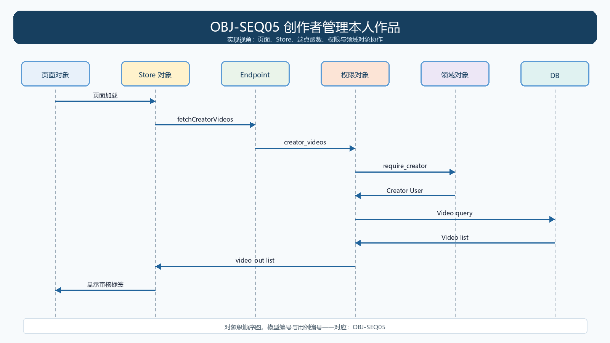
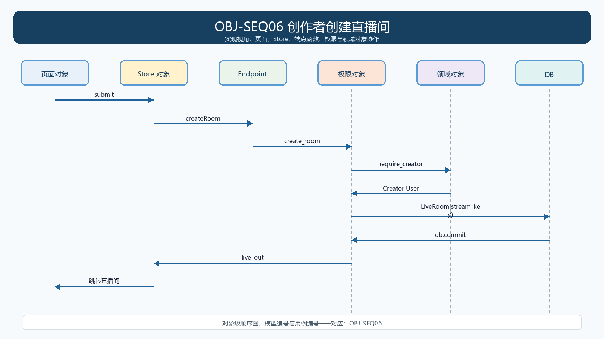
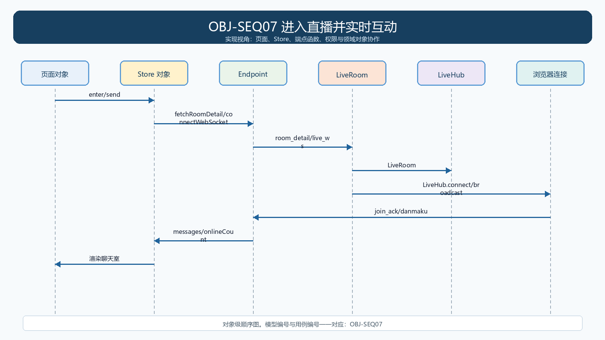
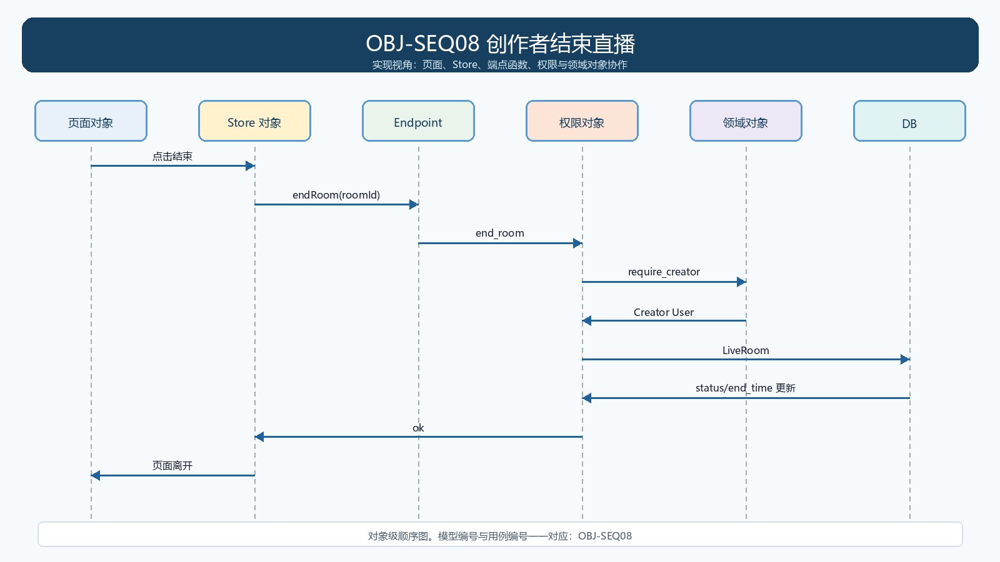

# 第9组 StreamHub 详细设计说明书

> 详细设计以 `backend/app/models.py`、`backend/app/main.py`、`src/stores/*.ts` 当前实现为准。

## 1. 代码结构

| 层 | 实现 |
|---|---|
| 表现层 | src/pages、src/components |
| 前端状态 | src/stores/authStore.ts、videoStore.ts、liveStore.ts |
| 接口层 | src/api.ts；backend/app/main.py |
| 认证与输入 | backend/app/security.py、schemas.py |
| 数据层 | backend/app/models.py、database.py、PostgreSQL |

## 2. 类图

## 3. 主要领域类

| 类 | 职责 | 表 |
|---|---|---|
| User | 账户、密码散列、角色、资料 | users |
| Category | 视频/直播分类 | categories |
| Video | 视频元数据、统计、上传者、审核状态 | videos |
| Comment | 视频评论、父评论关系 | comments |
| Danmaku | 视频或直播弹幕 | danmaku |
| LiveRoom | 直播间、主播、推拉流地址、状态 | live_rooms |

## 4. 每个用例的对象级模型与实现

### OBJ-SEQ01 发现并播放视频

- 需求/用例：REQ01 / UC01
- 实现模块：HomePage.tsx、SearchPage.tsx、VideoPage.tsx；videoStore.fetchVideos/fetchVideoDetail；main.py:list_videos/get_video/related
- 关键对象：HomePage/SearchPage/VideoPage、useVideoStore、list_videos/get_video、Video。
- 测试编号：UNIT-TC01 / INT-TC01 / E2E-TC01

### OBJ-SEQ02 视频互动

- 需求/用例：REQ02 / UC02
- 实现模块：VideoPage.tsx；videoStore.likeVideo/favoriteVideo/addComment/sendDanmaku；main.py:like_video/favorite_video/add_comment/add_danmaku
- 关键对象：VideoPage、useVideoStore、get_current_user、Video/Comment/Danmaku。
- 测试编号：UNIT-TC02 / INT-TC02 / E2E-TC02

### OBJ-SEQ03 创作者提交视频待审核

- 需求/用例：REQ03 / UC03
- 实现模块：UploadPage.tsx；videoStore.uploadVideo；main.py:create_video；models.py:Video
- 关键对象：UploadPage、useVideoStore、require_creator、Video。
- 测试编号：UNIT-TC03 / INT-TC03 / E2E-TC03

### OBJ-SEQ04 管理员审核视频

- 需求/用例：REQ04 / UC04
- 实现模块：AdminPage.tsx；videoStore.fetchPendingVideos/auditVideo；main.py:pending_videos/audit_video
- 关键对象：AdminPage、useVideoStore、require_admin、Video。
- 测试编号：UNIT-TC04 / INT-TC04 / E2E-TC04

### OBJ-SEQ05 创作者管理本人作品

- 需求/用例：REQ05 / UC05
- 实现模块：CreatorPage.tsx；videoStore.fetchCreatorVideos；main.py:creator_videos
- 关键对象：CreatorPage、useVideoStore、require_creator、Video。
- 测试编号：UNIT-TC05 / INT-TC05 / E2E-TC05

### OBJ-SEQ06 创作者创建直播间

- 需求/用例：REQ06 / UC06
- 实现模块：LiveStartPage.tsx；liveStore.createRoom；main.py:create_room；models.py:LiveRoom
- 关键对象：LiveStartPage、useLiveStore、require_creator、LiveRoom。
- 测试编号：UNIT-TC06 / INT-TC06 / E2E-TC06

### OBJ-SEQ07 进入直播并实时互动

- 需求/用例：REQ07 / UC07
- 实现模块：LivePage.tsx；liveStore.connectWebSocket/sendDanmaku；main.py:list_rooms/room_detail/live_ws；LiveHub
- 关键对象：LivePage、useLiveStore、room_detail/live_ws、LiveRoom、LiveHub。
- 测试编号：UNIT-TC07 / INT-TC07 / E2E-TC07

### OBJ-SEQ08 创作者结束直播

- 需求/用例：REQ08 / UC08
- 实现模块：LivePage.tsx；liveStore.endRoom；main.py:end_room；models.py:LiveRoom
- 关键对象：LivePage、useLiveStore、require_creator、LiveRoom。
- 测试编号：UNIT-TC08 / INT-TC08 / E2E-TC08

## 5. 状态约束

`Video.audit_status`：0 待审核、1 通过、2 驳回。`LiveRoom.status`：1 进行中、2 已结束。视频列表只返回 `status=0`、`audit_status=1` 且 `video_url` 以 `/demo-videos/` 开头的记录；直播列表只返回 `status=1`。

## 6. 实现缺口

上述约束是当前可运行基线，不代表完整产品。真实二进制上传、转码、推流媒体服务、用户级点赞/收藏、跨进程实时消息未实现，不得在答辩中称为已完成。
