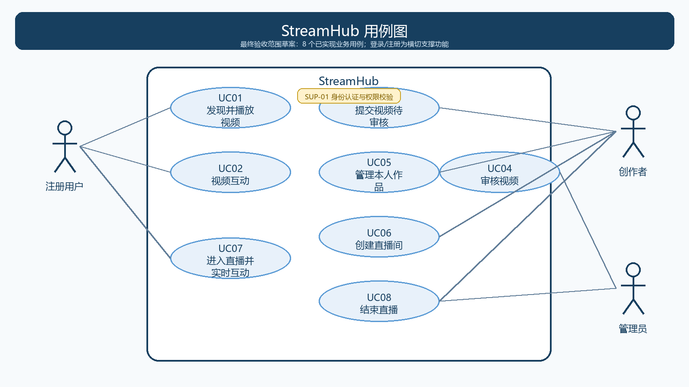
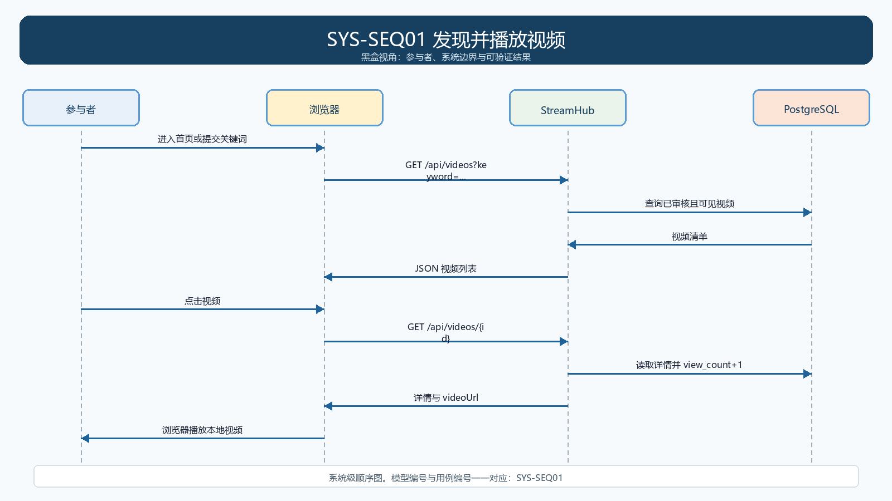
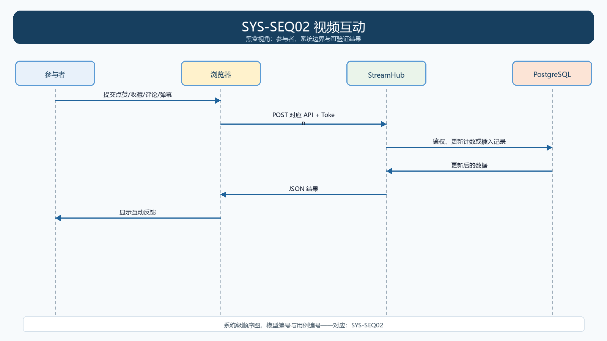
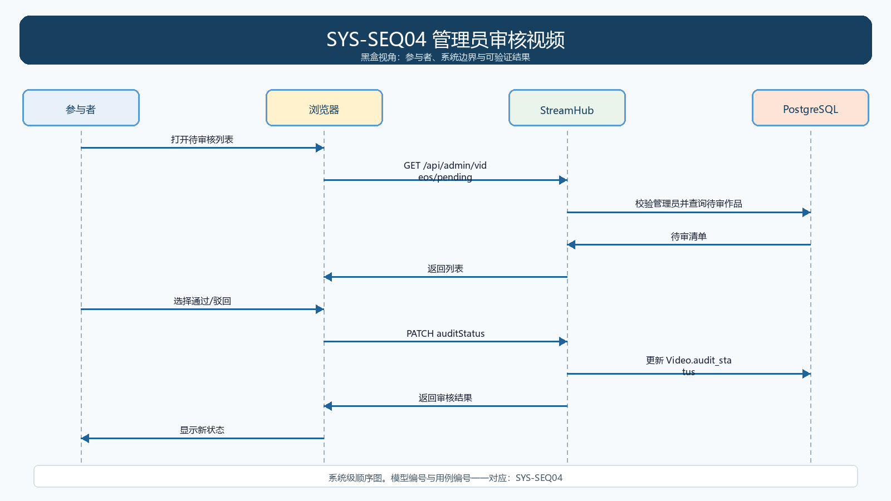
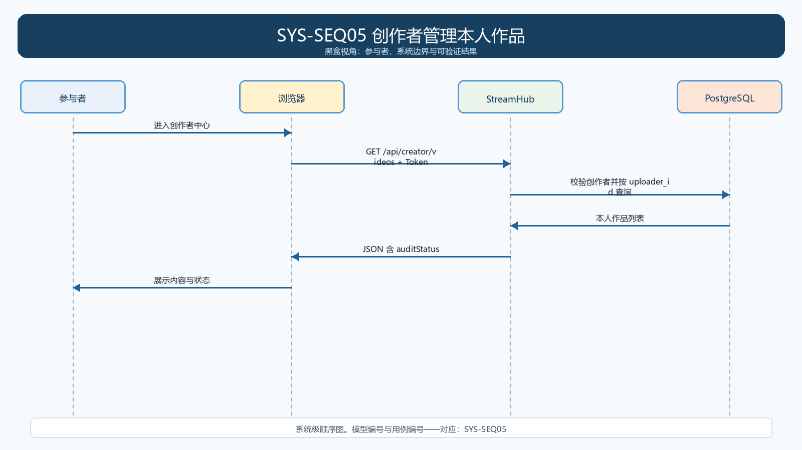
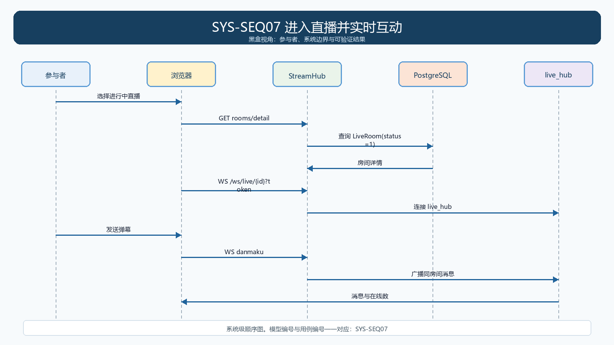
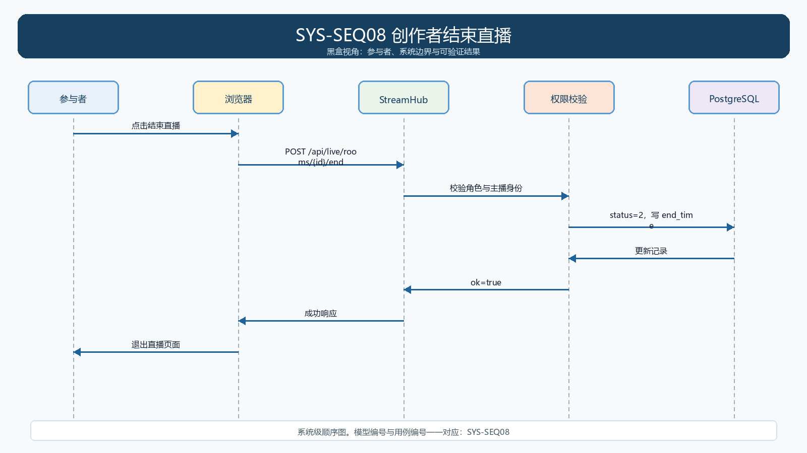
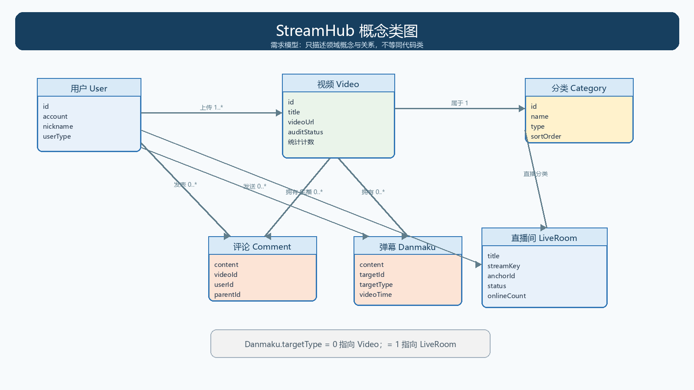

# 第9组 StreamHub 需求说明书

> 基线：`StreamHub` 当前 React + FastAPI + PostgreSQL 代码。范围为待教师/助教确认的最终验收草案。

## 1. 范围与边界

本说明书把一次完整业务目标算一个用例。登录、注册、搜索框、点赞按钮、单个接口不单独计数；它们作为业务用例的前置条件或步骤。

纳入：发现并播放视频、视频互动、作品提交与审核、作品管理、直播间创建、直播实时消息、结束直播。

不纳入（当前未形成可验收完整业务）：真实文件上传/转码、RTMP/HLS 媒体服务、举报处理、敏感词、订阅、短视频、个人主页模拟数据。

已知限制：`POST /api/videos` 创建元数据，默认指向演示视频；`LiveRoom` 只生成 RTMP/FLV 地址字符串，Compose 未部署 SRS；点赞/收藏只递增计数，未保存用户-视频关系。

## 2. 角色

| 角色 | 权限 |
|---|---|
| 注册用户 | 发现、播放、互动、进入直播间 |
| 创作者 | 注册用户权限 + 提交作品、管理本人作品、创建/结束本人直播 |
| 管理员 | 审核待审视频；结束直播时可绕过主播归属判断 |

## 3. 需求与用户故事

| 编号 | 需求 | 用户故事 | 验收结果 |
|---|---|---|---|
| REQ01 | 用户发现并播放视频 | 作为注册用户，我要按分类或关键词找到已审核视频并播放。 | 已审核视频列表、详情、播放状态 |
| REQ02 | 用户进行视频互动 | 作为注册用户，我要对视频点赞、收藏、发表评论和弹幕。 | 计数或新内容可查询 |
| REQ03 | 创作者提交视频 | 作为创作者，我要提交视频元数据并得到待审核结果。 | 新 Video 的 audit_status=0 |
| REQ04 | 管理员审核视频 | 作为管理员，我要通过或驳回待审核视频。 | 审核状态改变 |
| REQ05 | 创作者管理作品 | 作为创作者，我要查看本人作品及审核状态。 | 仅返回本人作品 |
| REQ06 | 创作者创建直播间 | 作为创作者，我要创建进行中的直播间。 | LiveRoom.status=1 |
| REQ07 | 用户直播实时互动 | 作为用户，我要进入直播间并看到实时消息与在线数。 | 同房间连接收到广播 |
| REQ08 | 创作者结束直播 | 作为主播，我要结束自己的直播间。 | status=2 且 end_time 非空 |
| REQ09 | 认证与角色授权 | 作为系统，我要在受保护操作前验证用户与角色。 | 无权限请求返回 401/403 |

## 4. 业务用例清单

| 用例 | 业务目标 | 参与者 | 需求 |
|---|---|---|---|
| UC01 | 发现并播放视频 | 注册用户 | REQ01 |
| UC02 | 视频互动 | 注册用户 | REQ02 |
| UC03 | 创作者提交视频待审核 | 创作者 | REQ03 |
| UC04 | 管理员审核视频 | 管理员 | REQ04 |
| UC05 | 创作者管理本人作品 | 创作者 | REQ05 |
| UC06 | 创作者创建直播间 | 创作者 | REQ06 |
| UC07 | 进入直播并实时互动 | 注册用户 | REQ07 |
| UC08 | 创作者结束直播 | 创作者 | REQ08 |

## 5. 用例图

## 6. 用例说明与系统级模型

### UC01 发现并播放视频

- 参与者：注册用户
- 触发条件：用户进入首页或输入关键词，希望找到可播放内容。
- 前置条件：后端、数据库、前端已启动；至少有已审核且本地视频路径的视频。
- 主成功流程：
  1. 选择分类或输入关键词
  2. 系统返回已审核、可见、本地视频列表
  3. 用户点击视频
  4. 系统返回详情并增加播放计数
  5. 浏览器使用 video 元素播放本地资源
- 备选/异常流程：
  - 关键词无匹配：返回空列表；页面显示无结果。
  - 视频 ID 不存在：接口返回 404。
- 可验证结果：用户看到匹配视频并进入可验证的播放状态。
- 编号：REQ01 / UC01 / SYS-SEQ01 / UNIT-TC01 / INT-TC01 / E2E-TC01

### UC02 视频互动

- 参与者：注册用户
- 触发条件：用户在视频详情页希望点赞、收藏、评论或发送弹幕。
- 前置条件：用户已登录；视频存在。
- 主成功流程：
  1. 用户选择互动动作并提交内容
  2. 系统校验 Token
  3. 系统更新 Video 计数或新增 Comment/Danmaku
  4. 系统返回更新结果
  5. 页面显示新计数或新内容
- 备选/异常流程：
  - 未登录或 Token 无效：返回认证失败。
  - 视频不存在：返回 404。
- 可验证结果：互动结果在页面和数据库中可查询。
- 编号：REQ02 / UC02 / SYS-SEQ02 / UNIT-TC02 / INT-TC02 / E2E-TC02

### UC03 创作者提交视频待审核

- 参与者：创作者
- 触发条件：创作者填写视频元数据并点击发布。
- 前置条件：用户已登录且 user_type >= 1；存在分类。
- 主成功流程：
  1. 创作者填写标题、简介、标签、分类
  2. 页面提交视频元数据
  3. 系统校验创作者角色
  4. 系统创建 Video，audit_status=0
  5. 系统返回待审核作品
- 备选/异常流程：
  - 普通用户提交：返回 403。
  - 分类或视频地址不合法：后端使用默认分类或演示视频地址。
- 可验证结果：作品出现在创作者作品列表和管理员待审核列表。
- 编号：REQ03 / UC03 / SYS-SEQ03 / UNIT-TC03 / INT-TC03 / E2E-TC03

### UC04 管理员审核视频

- 参与者：管理员
- 触发条件：管理员处理待审核视频。
- 前置条件：管理员已登录；存在 audit_status=0 的视频。
- 主成功流程：
  1. 管理员查询待审核视频
  2. 系统校验管理员角色
  3. 管理员选择通过或驳回
  4. 系统更新 audit_status
  5. 系统返回更新后的作品状态
- 备选/异常流程：
  - 非管理员访问：返回 403。
  - 视频不存在：返回 404。
- 可验证结果：审核状态可在作品管理和视频列表筛选逻辑中验证。
- 编号：REQ04 / UC04 / SYS-SEQ04 / UNIT-TC04 / INT-TC04 / E2E-TC04

### UC05 创作者管理本人作品

- 参与者：创作者
- 触发条件：创作者进入创作者中心查看自己提交的作品和审核状态。
- 前置条件：用户已登录且为创作者。
- 主成功流程：
  1. 创作者进入作品管理
  2. 系统校验创作者角色
  3. 系统按 uploader_id 查询视频
  4. 系统返回作品清单及审核状态、统计信息
  5. 页面展示作品状态
- 备选/异常流程：
  - 普通用户访问：返回 403。
  - 没有作品：返回空列表。
- 可验证结果：创作者能确认每个作品的审核状态。
- 编号：REQ05 / UC05 / SYS-SEQ05 / UNIT-TC05 / INT-TC05 / E2E-TC05

### UC06 创作者创建直播间

- 参与者：创作者
- 触发条件：创作者填写直播标题和分类后点击开播。
- 前置条件：用户已登录且为创作者。
- 主成功流程：
  1. 输入直播间标题、分类、封面
  2. 系统校验创作者角色
  3. 系统生成 stream_key
  4. 系统创建 LiveRoom(status=1)
  5. 系统返回直播间信息和推拉流地址字符串
- 备选/异常流程：
  - 普通用户创建：返回 403。
  - 分类无效：回退到直播分类。
- 可验证结果：可从直播列表查询到处于 status=1 的直播间。
- 编号：REQ06 / UC06 / SYS-SEQ06 / UNIT-TC06 / INT-TC06 / E2E-TC06

### UC07 进入直播并实时互动

- 参与者：注册用户
- 触发条件：用户选择进行中的直播间并发送实时消息。
- 前置条件：存在 status=1 的直播间；浏览器可建立 WebSocket。
- 主成功流程：
  1. 用户查询并进入直播间
  2. 系统返回直播间详情
  3. 浏览器携带 Token 建立 WebSocket
  4. live_hub 维护连接并广播进入消息
  5. 用户发送弹幕消息
  6. live_hub 向同房间连接广播消息与在线数
- 备选/异常流程：
  - 房间不存在：详情接口返回 404。
  - Token 缺失：以游客身份连接。
  - 连接断开：live_hub 移除连接并广播在线人数。
- 可验证结果：同一直播间的连接能看到实时消息和在线人数变化。
- 编号：REQ07 / UC07 / SYS-SEQ07 / UNIT-TC07 / INT-TC07 / E2E-TC07

### UC08 创作者结束直播

- 参与者：创作者
- 触发条件：主播完成直播后选择结束直播。
- 前置条件：用户已登录且为房间主播；房间存在。
- 主成功流程：
  1. 主播点击结束直播
  2. 系统校验创作者权限和 anchor_id
  3. 系统将 LiveRoom.status 置为 2，并写入 end_time
  4. 系统返回成功
  5. 页面退出当前直播状态
- 备选/异常流程：
  - 非主播且非管理员结束：返回 403。
  - 房间不存在：返回 404。
- 可验证结果：该房间不再出现在仅查询 status=1 的直播列表中。
- 编号：REQ08 / UC08 / SYS-SEQ08 / UNIT-TC08 / INT-TC08 / E2E-TC08

## 7. 概念类图

## 8. 确认记录

教师/助教确认时，需确认本清单 8 个用例是否为最终范围；如把未实现的真实上传或真实直播计入，必须在代码、测试和追溯表中补齐后才能标记完成。
