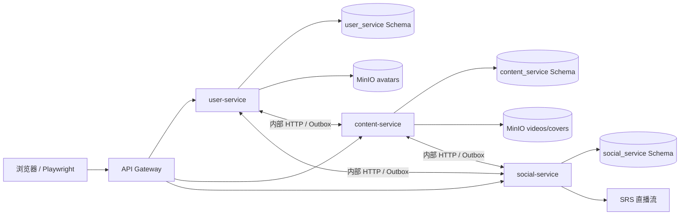
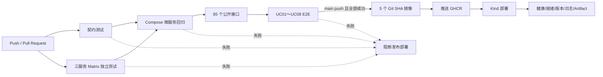

# StreamHub 项目与全部小学期课程任务说明

## 1. 文档目的

本文说明 StreamHub 项目是什么、前期课程任务完成了什么、后期如何从单体改造成微服务、测试和 CI/CD 如何落地、两项云原生实验及性能对比得到了什么结果。

本文负责解释“做了什么、为什么这样做、结果如何”；实际安装和运行命令见 `SE2026-microservices\README.md`，更细的测试顺序见 `SE2026-microservices\TESTING.md`。

文中的结论分为三类：

- **已验证事实**：有本地真实命令结果、JUnit、JSON、日志或 Kubernetes 资源快照；
- **设计或配置**：代码和工作流已经存在，但必须在对应外部环境实际运行后才能确认；
- **限制与推测**：明确标注，不能当作测试结论。

## 2. 项目概况

StreamHub 是一个视频内容、社交互动和直播平台，包含普通用户、内容创作者、管理员三类角色。

主要能力：

- 用户注册、登录、资料、头像、关注关系；
- 视频浏览、搜索、推荐、播放和相关视频；
- 点赞、收藏、评论、回复和弹幕；
- 创作者上传视频、管理作品、查看审核结果；
- 管理员审核视频、管理用户、举报和敏感词；
- 创建直播间、观看直播、实时聊天和结束直播；
- 私信、通知和直播管理；
- 用户上传视频、封面、头像的持久化存储。

项目最终同时保留两种后端形态：

1. `SE2026-microservices\backend`：改造前单体 FastAPI 后端，用于历史功能、单体测试和性能基线；
2. `SE2026-microservices\services`：改造后三个业务微服务，用于后 5 天课程验收。

## 3. 正式业务范围：UC01～UC08

课程正式业务场景冻结为 UC01～UC08。历史报告或规划材料中出现的更多编号不自动算入当前正式范围。

| 用例 | 业务场景 | 主要角色 | 端到端覆盖 |
| --- | --- | --- | --- |
| UC01 | 发现、搜索并播放视频 | 普通用户 | E2E-TC01-02 |
| UC02 | 评论、弹幕、点赞/收藏等视频互动 | 普通用户 | E2E-TC01-02 |
| UC03 | 创作者上传并发布视频 | 创作者 | E2E-TC03-05 |
| UC04 | 管理员审核投稿 | 管理员 | E2E-TC03-05 |
| UC05 | 创作者查看和管理审核结果 | 创作者 | E2E-TC03-05 |
| UC06 | 创建直播间 | 创作者 | E2E-TC06-08 |
| UC07 | 观众进入直播并实时互动 | 普通用户 | E2E-TC06-08 |
| UC08 | 结束直播并完成状态清理 | 创作者 | E2E-TC06-08 |

业务范围确认材料位于：

- `SE2026-microservices\第9组-StreamHub-业务场景确认与基线验收表.xlsx`
- `SE2026-microservices\9组-软件需求规格说明书.md`
- `SE2026-microservices\前5天分工与任务.md`

## 4. 技术栈与整体组成

| 层次 | 技术与作用 |
| --- | --- |
| 前端 | React 18、TypeScript、Webpack、Zustand、React Router |
| 单体后端 | FastAPI、SQLAlchemy、Pydantic、PostgreSQL |
| 微服务后端 | 三个独立 FastAPI 服务，共享有限基础模块 |
| API 入口 | Nginx Gateway，按业务路由、超时和错误映射 |
| 关系数据 | PostgreSQL 16，三个 Schema 和三个受限账号 |
| 对象存储 | MinIO，保存用户上传的视频、封面和头像 |
| 直播流 | SRS 5，提供本地 RTMP/HTTP-FLV 能力 |
| 容器与编排 | Docker、Docker Compose、Kubernetes、Kind |
| 自动化 | GitHub Actions、PowerShell、Bash、Python 脚本 |
| 测试 | pytest、Playwright、接口巡检、JUnit/JSON/Trace |
| 观测 | health、ready、version、日志、Events、Metrics Server |

## 5. 前期课程任务：需求、设计、实现与基线

### 5.1 需求分析

前期首先明确角色、功能边界、UC01～UC08、业务规则和验收口径。需求文档不是只列页面，而是把角色、前置条件、主流程、异常流程和数据要求连接起来。

主要材料：

- `SE2026-microservices\9组-软件需求规格说明书.md`
- `SE2026-microservices\第9组-StreamHub-业务场景确认与基线验收表.xlsx`
- `SE2026-microservices\前5天分工与任务.md`
- `SE2026-microservices\第 9 组 StreamHub —— 前 5 天分工与任务（825–829）均衡版【5 人小组修改版】.md`

### 5.2 概要设计

概要设计说明系统分层、模块职责、数据流、主要技术选择、前后端关系、数据库和媒体/直播基础设施。

材料：

- `SE2026-microservices\9组-软件概要设计说明书.md`
- `SE2026-microservices\微服务划分.md`
- `SE2026-microservices\第9组-StreamHub-图`

### 5.3 详细设计

详细设计进一步落实页面、接口、数据模型、业务状态转换、异常处理、推荐、弹幕和直播流程。

材料：

- `SE2026-microservices\9组-软件详细设计说明书.md`
- `SE2026-microservices\assets\#U524d#U7aef#U9875#U9762#U8be6#U7ec6#U8bbe#U8ba1.md`
- `SE2026-microservices\assets\#U5f39#U5e55#U7cfb#U7edf#U8bbe#U8ba1.md`
- `SE2026-microservices\assets\#U6570#U636e#U5e93#U8be6#U7ec6#U8bbe#U8ba1.md`
- `SE2026-microservices\assets\#U76f4#U64ad#U7cfb#U7edf#U8bbe#U8ba1.md`

### 5.4 单体功能实现

改造前版本由一个 FastAPI 应用处理用户、视频、互动、审核和直播业务。React 前端通过一个后端入口访问业务，PostgreSQL 保存关系数据，SRS 提供直播流。

单体结构适合小团队快速开发，调用直接、单次请求开销较小；缺点是所有业务共享进程、数据库账号和部署单元，任何模块变化都可能要求整体构建和部署，也不利于按不同负载独立扩缩容。

单体代码和部署入口：

- `SE2026-microservices\backend`
- `SE2026-microservices\src`
- `SE2026-microservices\docker-compose.yml`
- `SE2026-microservices\k8s\backend.yaml`
- `SE2026-microservices\k8s\frontend.yaml`

## 6. 前期测试任务和测试报告

### 6.1 测试分层

项目把质量验证分为：

- 单元/规则测试：验证审核状态、业务判断和独立函数；
- API/集成测试：验证接口、鉴权、数据库变化和失败路径；
- E2E 系统测试：从浏览器执行 UC01～UC08；
- 流水线门禁：负责自动运行测试、构建、部署和留证，本身不是第四种业务测试类型。

早期测试报告位于：

- `SE2026-microservices\0826测试报告\UNIT-TC04-01-审核状态规则`
- `SE2026-microservices\0826测试报告\API-TC04-审核接口集成测试`
- `SE2026-microservices\0826测试报告\E2E-TC01-08-完整业务流程`
- `SE2026-microservices\0826测试报告\README.md`

每组材料包含实施计划、测试说明、给小白看的说明、测试报告、流水线门禁记录和失败证据。失败截图和 Trace 保留用于证明门禁能够发现真实问题，不能拿历史失败冒充最终版本失败。

### 6.2 测试用例和测试点

“测试用例数”和“测试点数”分开统计：

- 后端测试函数：29 个；
- pytest 参数化收集项：38 项；
- E2E 组合场景：3 个；
- 单元测试点：60；
- API/集成测试点：107；
- E2E 测试点：60；
- 失败或异常路径测试点：29；
- 测试点总数：227。

测试点报告由 `SE2026-microservices\scripts\test_point_report.py` 自动生成，门禁检查总数不少于 200、E2E 不少于 60，不能手工改报告数字代替测试。

### 6.3 端到端测试的实际业务

三个 E2E 场景不是只打开页面：

1. 普通用户登录、搜索视频、播放、发表评论和弹幕；
2. 创作者真实上传视频、发布、管理员审核、创作者查看审核结果；
3. 创作者创建直播、观众连接 WebSocket 并发送直播消息、接口结束直播和清理。

代码：`SE2026-microservices\e2e\streamhub.spec.ts`。

## 7. 媒体持久化任务

用户上传媒体与演示资源被明确区分：

| 数据 | 最终保存位置 |
| --- | --- |
| 用户、标题、审核状态、互动等关系数据 | PostgreSQL |
| 用户上传视频和封面 | MinIO `uploads/videos/*`、`uploads/covers/*` |
| 用户头像 | MinIO `avatars/*` |
| 固定演示素材 | `SE2026-microservices\public\demo-videos`、`SE2026-microservices\public\demo-covers` |

PostgreSQL 只保存媒体 URL，不保存大型媒体文件；MinIO 是对象存储，不是第二个关系数据库。媒体读取支持 HTTP Range，用户可拖动视频进度。

旧媒体迁移采用幂等复制：目标已存在就跳过，原文件不删除。这样既能迁移到对象存储，也避免误删历史上传内容。

## 8. 后 5 天任务一：三个业务微服务

### 8.1 服务划分

后端按业务所有权、事务边界、故障影响和扩缩容特征划分，而不是按用例数量机械切分。

| 业务服务 | 负责业务 | 独立原因 |
| --- | --- | --- |
| user-service | 注册登录、令牌、资料、头像、关注、聊天、通知、用户管理 | 身份与私密通信属于同一安全边界；用户故障不应拖垮公开视频读取 |
| content-service | 分类、视频元数据、上传、封面、投稿、审核、创作者内容、搜索和 Feed | 视频生命周期和审核属于同一聚合；媒体 I/O 可独立部署 |
| social-service | 点赞、收藏、评论、弹幕、直播、举报、敏感词 | 写入和直播连接波动最大，适合独立扩缩容和故障隔离 |

Gateway、前端、PostgreSQL、MinIO、SRS 都不计入三个业务微服务。

### 8.2 独立构建、测试和部署

每个业务服务拥有自己的：

- `Dockerfile`；
- Python 依赖文件；
- FastAPI 应用；
- pytest 目录；
- Docker Compose Service；
- Kubernetes Deployment 和 Service；
- health、ready、version 接口；
- 数据库账号和 Schema。

入口：

- `SE2026-microservices\services\user-service`
- `SE2026-microservices\services\content-service`
- `SE2026-microservices\services\social-service`
- `SE2026-microservices\docker-compose.microservices.yml`
- `SE2026-microservices\k8s\microservices`

### 8.3 数据表唯一归属

数据库 `streamhub` 使用三个 Schema 和三个受限账号。服务账号只能访问本服务 Schema，跨服务 ID 只作为普通 ID 保存，不建立跨 Schema 外键。

| Schema | 归属服务 | 主要表 |
| --- | --- | --- |
| `user_service` | user | users、follows、conversations、messages、notifications、processed_events |
| `content_service` | content | categories、videos、integration_outbox、processed_events |
| `social_service` | social | comments、comment_mentions、video_likes、video_favorites、video_interaction_baselines、danmaku、live_rooms、reports、sensitive_words、integration_outbox、processed_events |

MinIO 也按前缀确定唯一写入者：user 只操作 `avatars/*`；content 只操作 `uploads/videos/*` 和 `uploads/covers/*`；social 不直接读写媒体。

完整表归属：`SE2026-microservices\docs\microservices\table-ownership.md`。

### 8.4 跨服务调用和失败处理

其他服务不能直接查询不属于自己的表。跨服务操作使用内部 HTTP 或 Outbox 事件：

- 同步连接超时 0.5 秒、总超时 1.5 秒；
- GET/HEAD 可以退避重试；
- POST/PUT/PATCH/DELETE 不自动重试，避免重复写；
- 调用携带 `X-Request-ID`；
- 受保护写操作依赖失败时返回 503，不写本地业务表；
- 公开读允许使用备用值，并通过 `X-StreamHub-Degraded` 标记降级；
- 跨服务写通过 Outbox 指数退避，接收端用 processed_events 幂等；
- 第 10 次仍失败的事件进入 `dead`，可从内部诊断接口查看；
- Gateway 对外隐藏所有 `/internal/*`，固定返回 404。

公开 API 共 85 项：user 30、content 23、social 32；另有 11 个内部接口。完整清单：`SE2026-microservices\docs\microservices\service-api-catalog.md`。

设计和证据：

- `SE2026-microservices\docs\microservices\service-architecture.md`
- `SE2026-microservices\docs\microservices\table-ownership.md`
- `SE2026-microservices\docs\microservices\cross-service-calls.md`
- `SE2026-microservices\docs\microservices\service-api-catalog.md`
- `SE2026-microservices\docs\microservices\monolith-vs-microservices.md`
- `SE2026-microservices\docs\microservices\version-manifest.json`

## 9. 后 5 天任务二：自动构建、测试和部署

### 9.1 CI/CD 设计

工作流：`SE2026-microservices\.github\workflows\ci.yml`。

四个 Job：

1. `contract-tests`：工作区、Schema、Gateway、Kubernetes、接口与 CI/CD 契约；
2. `service-tests`：三个业务服务 Matrix 独立安装依赖和测试；
3. `microservices-regression`：自动构建 Compose、巡检 85 个接口、运行 E2E；
4. `build-deploy`：只有 main push 且前三层成功后，制作并推送不可变镜像、部署 Kind、保存证据。

Runner 由仓库变量 `USE_SELF_HOSTED` 选择，未设置时默认全部使用 GitHub 自带 `ubuntu-latest`；设为 `true` 时 Pull Request 与可信 main push 均切到队友整合的 Linux x64 `self-hosted` Runner 模式。这里没有机械覆盖队友的单体 CI：如果原样覆盖，会丢失三个业务服务独立测试、85 个接口、微服务 Gateway 和微服务 Kubernetes 清单。

队友 CI 运行模型的对照来源是 `Cespale/SE2026` 提交 `76b18e947342fcb459e3ef7c008e4c0f53aa108b`。本项目吸收的是 self-hosted Runner 思路，而不是把该提交中的单体构建步骤原样替换进来。

### 9.2 自动化范围

一次完整本地 Kind 门禁会自动完成：

- 契约与三服务测试；
- 前端类型检查；
- 5 个不可变版本镜像；
- Compose 自动部署；
- 83 个 HTTP 和 2 个 WebSocket 共 85 项接口覆盖；
- 三个 Playwright 流程覆盖 UC01～UC08；
- Kind 镜像导入、数据库迁移和滚动部署；
- 12 个 health/ready/version 检查；
- Node、Deployment、Pod、Service、HPA、日志和事件证据。

### 9.3 最新本地完整结果

2026-09-02 人工复跑版本：`manual-20260902110259`。

| 检查 | 实际结果 |
| --- | --- |
| 契约/共享测试 | 85 passed |
| user-service | 12 passed |
| content-service | 14 passed |
| social-service | 13 passed |
| TypeScript | 通过 |
| Docker 镜像 | user、content、social、gateway、frontend 共 5 个成功 |
| 公开 API | 85/85，83 HTTP + 2 WebSocket |
| E2E | 3/3，覆盖 UC01～UC08 |
| 本地门禁 | `LOCAL_MICROSERVICES_GATE=PASS` |
| Kind 部署 | `KIND_CICD_GATE=PASS` |
| 可观测接口 | Gateway 与三服务共 12 项全部通过，版本精确一致 |
| Kubernetes | 3 个业务服务、Gateway、PostgreSQL、MinIO 均 Ready；迁移 Job Completed |

证据：`SE2026-microservices\.ci-results\kind-cicd\manual-20260902110259`。

该目录包含 contracts、三个服务 JUnit、public-api JSON/XML、E2E JUnit、Playwright 附件、Compose 状态、服务日志、observability JSON、Kind 资源快照和诊断。

该 `.ci-results` 目录属于本机运行产物，Git clone 默认不会下载；ZIP 也只有在打包者保留时才会包含。可随 Git 获取的固定课程证据位于 `SE2026-microservices\docs\microservices\evidence`，新的接收电脑仍应重新执行门禁并生成自己的证据。

### 9.4 部署失败诊断

`SE2026-microservices\scripts\run-deployment-failure-drill.ps1` 故意请求一个不存在且禁止自动拉取的不可变镜像：

1. 部署命令失败并保留原始输出；
2. `docker image inspect` 证明错误标签不存在；
3. 对照正确标签存在；
4. 当前 user-service 版本仍可访问；
5. 形成 result.json 和 report.md。

正确结果是 `DEPLOYMENT_FAILURE_DRILL=EXPECTED_FAILURE`。这是“门禁成功发现部署错误”，不是系统无法修复。

### 9.5 本地与远程事实边界

本地完整门禁已经真实通过。远程 GitHub Actions 是否成功，必须以对应提交的 Actions Run、在线 Runner、Artifact 和 GHCR 记录为准。本地测试结果不能替代远程证据。

## 10. 后 5 天任务三：两项云原生实验

### 10.1 自动扩缩容

user-service 配置：

- CPU request / limit：100m / 500m；
- 内存 request / limit：128Mi / 512Mi；
- HPA CPU 目标：40%；
- 副本范围：1～4；
- Metrics Server 提供 CPU 指标。

主实验结果：

| 并发 | 持续时间 | 请求 | 成功/错误 | 吞吐 | 平均响应 | P95 | 错误率 | Pod |
| ---: | ---: | ---: | ---: | ---: | ---: | ---: | ---: | --- |
| 4 | 121.187 s | 244 | 244/0 | 2.013 req/s | 1975.251 ms | 3802.347 ms | 0% | 1→4→1 |

这证明压力上升后 Pod 增加、压力下降后 Pod 减少。登录包含 bcrypt，目标是制造 CPU 压力和观察 HPA，不代表普通读接口的最大吞吐。

高并发 12 过载对照：805 请求、173 成功、632 错误、错误率 78.509%，Pod 仍为 1→4→1。这个结果说明 HPA 有控制周期，突发流量可能在扩容前压满单 Pod，不能把“最终扩容”误写成“全程没有错误”。

### 10.2 故障处理

实验主动把 content-service 缩容到 0：

| 探测 | 结果 | 说明 |
| --- | --- | --- |
| `GET /api/videos` | 503，固定 JSON 提示 | 超时返回/备用错误生效 |
| user-service health | 200 | 用户服务未级联崩溃 |
| social-service health | 200 | 社交服务未级联崩溃 |
| 恢复 content-service | rollout success | 服务恢复 |
| 恢复后 `/api/live/rooms` | 200 | 跨服务链路恢复 |

本项目实现的是“超时返回 + 故障隔离”，不是完整熔断器。Gateway 不自动重试非幂等写请求，防止故障时重复写入。

报告与证据：

- `SE2026-microservices\docs\microservices\cloud-native-experiments.md`
- `SE2026-microservices\docs\microservices\evidence\cloud-native\20260831-103639880`
- `SE2026-microservices\docs\microservices\evidence\cloud-native\20260901-193650344-recovery-fix-powershell51`

## 11. 后 5 天任务四：单体与微服务性能对比

### 11.1 公平性

对比遵守：同一台机器、同一 PostgreSQL、同一批数据、同一压测器、相同并发、交替运行顺序、每个版本每个接口至少 3 次。

数据集：3 个用户、10 个分类、18 个视频；迁移前后行数和内容摘要一致。测试接口：分类列表、最新视频列表、登录。

### 11.2 三轮均值

| 接口 | 单体吞吐 req/s | 微服务吞吐 req/s | 单体平均/P95 ms | 微服务平均/P95 ms | 错误率 |
| --- | ---: | ---: | ---: | ---: | ---: |
| 分类列表 | 68.118 | 48.370 | 58.710 / 102.193 | 82.588 / 183.903 | 两版 0% |
| 最新视频列表 | 18.579 | 12.288 | 218.504 / 399.680 | 339.155 / 679.057 | 两版 0% |
| 登录 | 0.933 | 0.904 | 4246.404 / 4702.404 | 4401.777 / 4699.154 | 两版 0% |

微服务吞吐分别低约 28.99%、33.86%、3.11%；应用总内存约为单体的 2.86～2.91 倍。因此本项目不能写“微服务性能提升”。

差异解释：

1. Gateway 和容器网络增加固定转发成本；
2. 视频列表需要 content→user 批量补充上传者信息，增加 HTTP 和 JSON 成本；
3. 登录主要耗时是两版相同的 bcrypt，因此差异较小；
4. 微服务常驻多个解释器、连接池和探针，内存成本更高；
5. 微服务换来的主要收益是业务隔离、独立发布、故障隔离和按服务扩缩容，而不是本次小数据集下的单请求速度。

报告与原始数据：

- `SE2026-microservices\docs\microservices\performance-comparison.md`
- `SE2026-microservices\docs\microservices\evidence\performance\20260831-114658527-main`
- `SE2026-microservices\docs\microservices\evidence\performance\20260831-113157084-overload`

## 12. 这几天发现并修复的真实问题

这些修复不是为了让测试“看起来变绿”，而是由失败日志、Trace、服务状态或最小复现定位后处理。

| 问题 | 根因 | 处理 |
| --- | --- | --- |
| 直播 UI 显示连接但无法发消息 | 旧 WebSocket 的异步 onclose 清掉新连接状态 | 只允许当前 socket 清理状态，并用直播 E2E 验证 |
| 用户上传媒体不适合写仓库 | 运行时媒体与演示资源混在本地目录 | PostgreSQL 保存 URL，MinIO 保存对象；旧数据幂等迁移且不删原件 |
| Compose 显示启动但 E2E 首次导航超时 | 前端容器没有真正就绪的 healthcheck | 增加前端 HTTP 健康检查，让 `compose --wait` 等待可服务状态 |
| E2E 登录/审核/直播偶发 503 | 多个 Kind 控制面与 Compose 同时争用 Docker 资源 | 完整门禁测试前暂停全部 Kind control-plane，结束后恢复 |
| Windows PowerShell 5.1 不能使用 `Get-FileHash` | 部分本机模块环境缺少该命令 | 用 .NET SHA256 API 替代，继续固定哈希并失败关闭 |
| `kind get clusters` 有记录但节点不能复用 | control-plane 容器已经停止 | 检查容器状态，必要时 `docker start` 后再导出 kubeconfig |
| PowerShell 5.1 解析/执行云原生脚本失败 | 使用 `??`、`-SkipHttpErrorCheck`、BOM 和不可靠 ExitCode | 改为 5.1 兼容写法，并在 5.1 实际复跑 |
| 干净 Kind 导入 MinIO 镜像失败 | 多平台 manifest 与本机内容不一致 | 使用经摘要固定的 amd64 单平台归档 |
| 后端-only 部署缩容不存在资源 | 脚本假定前端/SRS Deployment 一定存在 | 先检查资源存在再操作 |
| 故障脚本先写 PASS 后才恢复服务 | 恢复是 finally 尽力操作，不是成功条件 | 把 rollout 和跨服务 200 变成 PASS 前硬性验收 |
| 长业务流程固定时间不稳定 | 投稿包含约 38 MiB 上传，直播需等待资源恢复 | 使用业务条件等待；持续 503 仍失败，不盲目吞错 |
| 队友 CI 原样覆盖会退回单体 | 上游 CI 只构建单体前后端 | 只整合 self-hosted 运行模型，保留微服务四门禁和 5 镜像 |

修复后的最终完整门禁使用新不可变版本重新跑过，不能用旧成功文件代替。

## 13. 课程要求与交付物对应

| 课程要求 | 项目实现 | 主要交付物 |
| --- | --- | --- |
| 需求、设计和图 | UC01～UC08、需求/概要/详细设计、图和验收表 | `SE2026-microservices\9组-软件*.md`、`SE2026-microservices\第9组-StreamHub-图` |
| 单元/API/E2E 测试 | 29 后端函数、38 pytest 项、3 E2E、227 测试点和历史报告 | `SE2026-microservices\0826测试报告`、`SE2026-microservices\e2e` |
| 至少三个业务微服务 | user、content、social，独立镜像/测试/部署 | `SE2026-microservices\services`、service-architecture.md |
| 表归属与禁止跨库联表 | 三 Schema、三受限账号、Schema 隔离测试 | table-ownership.md、数据库迁移脚本 |
| 跨服务失败处理 | HTTP 超时/降级、Outbox、重试、dead、幂等 | cross-service-calls.md、服务测试 |
| 服务图/接口/表/调用说明 | 完整文档和 85 接口清单 | `SE2026-microservices\docs\microservices` |
| 改造前后代码 | 单体目录保留，微服务目录新增，哈希清单 | monolith-vs-microservices.md、version-manifest.json |
| 自动构建部署 | GitHub Actions + 本地 Compose→Kind 一键门禁 | ci.yml、run-kind-cicd-gate.ps1 |
| 部署 / 回滚脚本 | 前向部署 deploy-microservices.sh / deploy.sh；回滚 rollback-microservices.sh / rollback.sh：把服务退回上一不可变版本、等待滚动就绪并精确校验 `/version`；数据库只前滚不回滚 | scripts/deploy*.sh、scripts/rollback*.sh |
| 全公开接口和全业务回归 | 85/85 API、3/3 E2E 覆盖 UC01～UC08 | public-api JSON/XML、e2e.xml、Trace |
| 日志、探针、版本和失败诊断 | 12 个观测接口、日志/Events、受控错误镜像 | observability、kind-diagnostics、failure-drill |
| 自动扩缩容 | HPA 1→4→1，四项性能指标 | cloud-native-experiments.md、原始 CSV/JSON |
| 故障处理 | content 503，user/social 200，恢复后链路 200 | fault-results、recovery-results、日志 |
| 改造前后性能 | 三接口、两版本、各 3 次、CPU/内存 | performance-comparison.md、18 轮原始结果 |

## 14. 目录说明

| 路径 | 内容 |
| --- | --- |
| `SE2026-microservices\src` | 前端页面、组件、Store 和 API 调用 |
| `SE2026-microservices\backend` | 单体后端与单体测试 |
| `SE2026-microservices\services` | 三个业务微服务与独立测试 |
| `SE2026-microservices\shared` | 共享的请求 ID、内部客户端等有限基础能力 |
| `SE2026-microservices\gateway` | Nginx 路由、超时、WebSocket 和错误映射 |
| `SE2026-microservices\database` | 三 Schema、角色、迁移和隔离设计 |
| `SE2026-microservices\k8s\microservices` | Deployment、Service、PVC、HPA 和 Job |
| `SE2026-microservices\scripts` | 门禁、部署、实验、压测、迁移和诊断 |
| `SE2026-microservices\tests\microservices` | 架构和交付契约测试 |
| `SE2026-microservices\e2e` | UC01～UC08 浏览器回归 |
| `SE2026-microservices\0826测试报告` | 前期测试计划、报告和历史证据 |
| `SE2026-microservices\docs\microservices` | 后 5 天四项任务设计、报告和原始证据 |
| `SE2026-microservices\.ci-results` | 本机每次门禁产生的结果，不是源码依赖 |

## 15. 已验证事实、风险和不能夸大的结论

### 15.1 已验证

- 需求、概要、详细设计、业务场景、图和测试材料存在；
- 单体与微服务代码均保留；
- 三个业务微服务可以独立构建、测试和部署；
- 数据表和对象存储前缀有唯一归属；
- 最新人工本地门禁 85/85 API、3/3 E2E、Kind 部署和 12 个观测接口通过；
- HPA 和故障实验在真实本地 Kind 执行并保存原始结果；
- 单体/微服务性能对比按相同条件各运行至少 3 次。

### 15.2 不能直接声称

- 不能只凭本地 PASS 说某次远程 GitHub Actions 已通过；
- 不能说本次微服务性能提升，实测总体更慢且更占内存；
- 不能把单机 Kind 结果外推成生产环境容量；
- 不能把 85 个接口存在性/鉴权巡检说成 85 个完整成功业务流程；成功路径由服务测试和 E2E 补足；
- 不能把 MinIO 称为第二数据库；
- 不能隐瞒并发 12 的高错误率过载结果。

### 15.3 仍需注意的成本和变量

- `SE2026-microservices\public\demo-videos` 约 464 MiB，前端镜像和 Kind 导入耗时较长；
- 多个 Kind 集群同时运行会大量占用 CPU 和内存；
- HPA 有采样与控制周期，扩容不是瞬时发生；
- K8s 新数据库初始化 Schema/角色/表，不等于自动迁移所有单体演示数据；
- 当前推荐接口为通用推荐，没有完整重建单体的个性化偏好算法；
- 本地 Kind 使用的 Metrics Server insecure Kubelet TLS 参数只适合实验，不适合生产；
- ZIP 若包含虚拟环境、node_modules 或真实密钥，需要在接收电脑重新安装和重新生成配置。

## 16. 建议的课程现场展示顺序

1. 展示需求、概要、详细设计和 UC01～UC08 验收表；
2. 打开 Compose 网页，用 user、creator、admin 演示完整角色流程；
3. 展示三个服务目录、服务划分图、表归属和跨服务调用；
4. 运行或展示最新 Kind 门禁证据：85/85 API、3/3 E2E、不可变版本和 Pod Ready；
5. 查看 Gateway 和三服务日志、health、ready、version；
6. 演示不存在镜像的预期部署失败及诊断链；
7. 三终端展示 HPA 1→4→1；
8. 展示停止 content 后 503/200/200 和恢复后 200；
9. 展示性能三轮汇总和原始 CSV/JSON，主动说明未测出性能提升；
10. 最后说明本地与远程、实验与生产、成功区间与过载区间的事实边界。

## 17. 总结

StreamHub 已从一个能完成视频、互动和直播业务的单体系统，扩展为具有明确业务边界、独立数据所有权、跨服务故障策略、自动测试与部署、本地 Kubernetes 实验和可复查性能证据的课程项目。

项目最有价值的结果不是“微服务一定更快”，而是把软件工程要求落实为可执行和可验证的闭环：

- 需求能够追溯到设计、代码和测试；
- 服务边界能够追溯到表、接口、镜像和 Deployment；
- 测试失败能够阻断部署并留下证据；
- 故障不会让所有服务一起崩溃；
- 扩缩容和性能结论来自原始数据；
- 已验证事实、未验证外部条件和系统限制被明确分开。

按 `SE2026-microservices\README.md` 在新电脑重新执行，出现 `KIND_CICD_GATE=PASS` 后，再完成云原生和性能脚本，即可形成一套可运行、可演示、可解释和可复查的完整课程交付。
